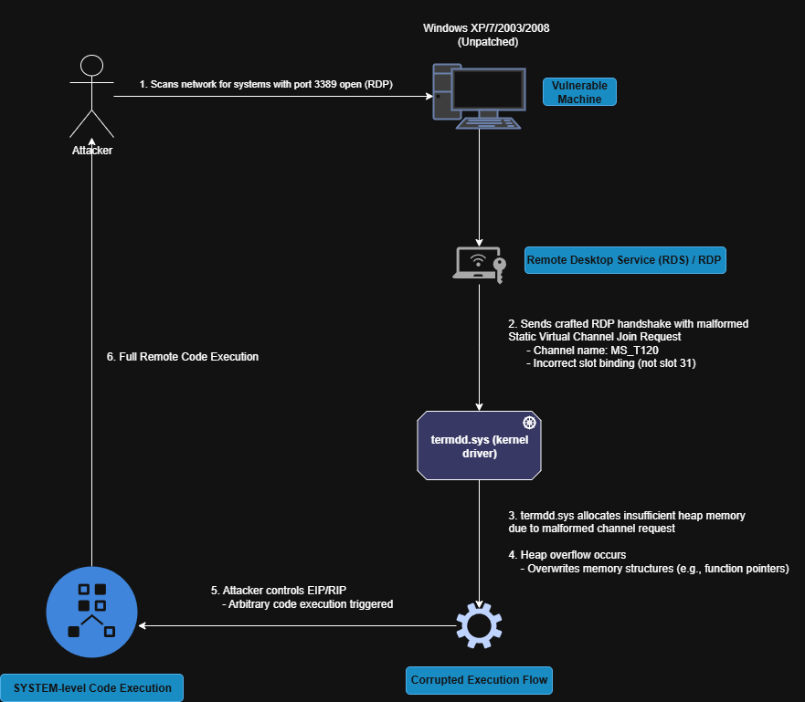
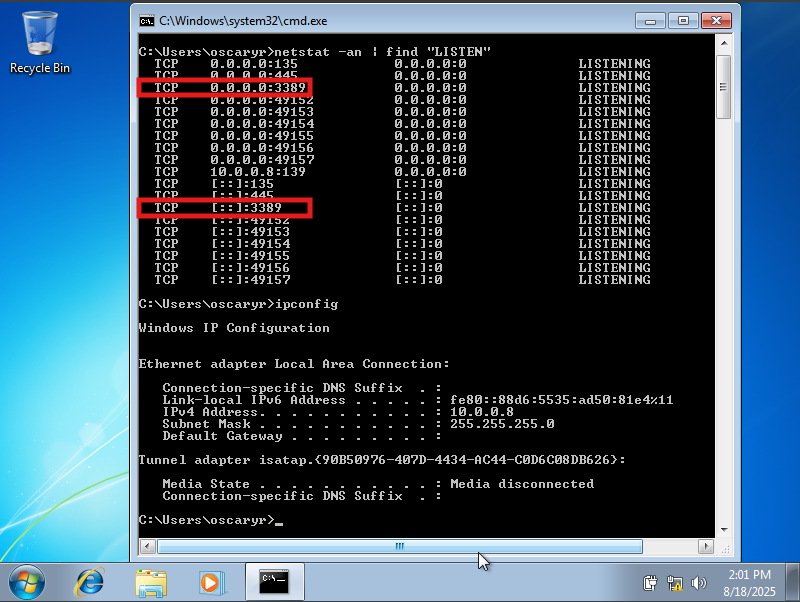
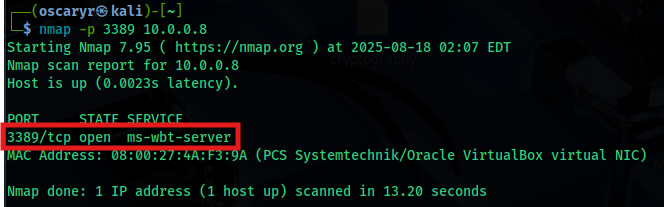
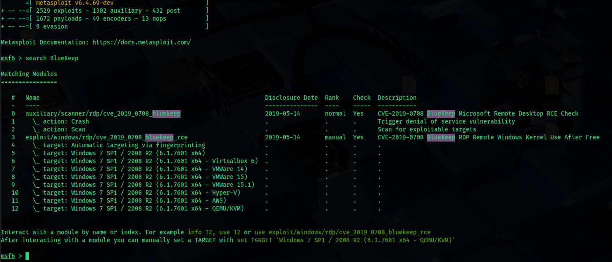
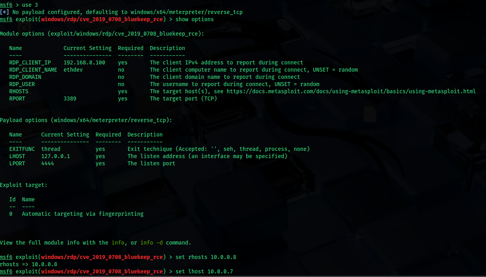
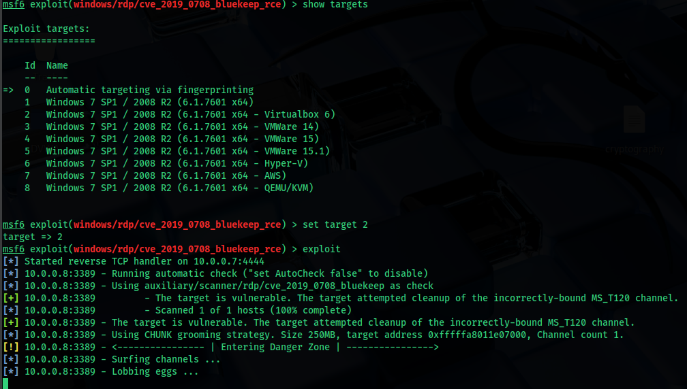
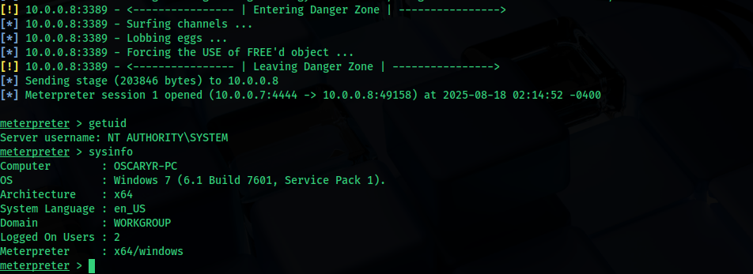
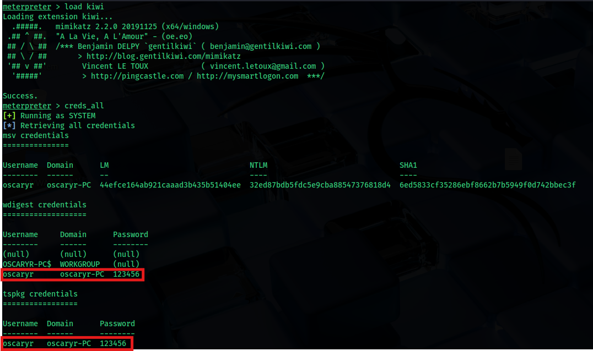
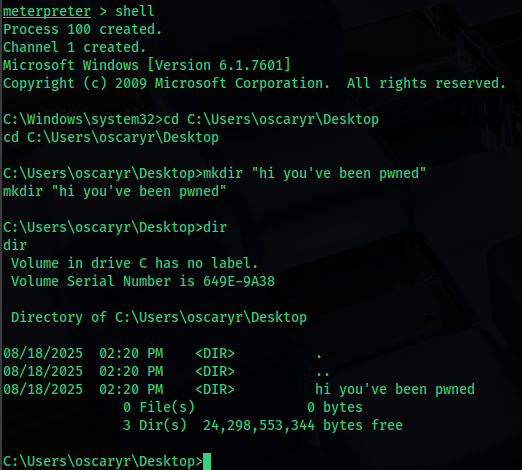
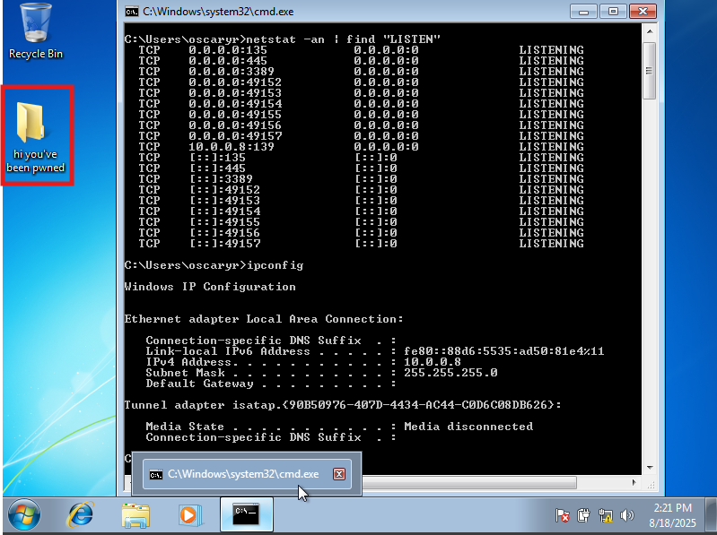

# CVE Reproduce: BlueKeep (CVE-2019-0708)

### Details

CVE ID:  
**CVE-2019-0708**

Vulnerability Name:  
**BlueKeep**

Vulnerable Software:  
- **Microsoft Remote Desktop Services (RDS), formerly known as Terminal Services**
- **Windows 2000 through Windows Server 2008 R2 and Windows 7**

Vulnerability Type:  
**Remote Code Execution (Unauthenticated, pre-auth)**

Severity:  
- **9.8 CVSS v3 (Critical), 10.0 CVSS v2 (Critical)**
- **Wormable vulnerability**

---

### Summary

BlueKeep is a critical Remote Desktop Protocol (RDP) vulnerability discovered in May 2019. It allows an unauthenticated attacker to gain remote code execution on vulnerable systems by sending specially crafted RDP requests before authentication occurs.

What makes BlueKeep dangerous is its wormable nature, which allow attackers to build self-propagating malware (like WannaCry did with EternalBlue) that automatically spreads across unpatched systems.

Microsoft took the rare step of releasing patches even for end-of-life operating systems (XP and Server 2003), showing how serious of the flaw is.

---

### Example of the Vulnerability

1. The attacker scans a network to identify systems with Remote Desktop Protocol (RDP) enabled and accessible (default port 3389/TCP).

2. Upon finding a vulnerable host, the attacker sends a specially crafted RDP request during the initial connection handshake.

3. This malformed request exploits a flaw in the Windows RDP service (specifically in the `termdd.sys` kernel driver).

4. The flaw leads to a heap-based buffer overflow, allowing the attacker to overwrite memory structures within the RDP service.

5. By controlling the overwritten data (such as function pointers), the attacker can hijack the execution flow and execute arbitrary code.

6. This code runs with SYSTEM-level privileges, granting full control over the affected machine.

7. Because the vulnerability occurs before authentication, the attacker does not need valid login credentials, making this a pre-auth remote code execution flaw.

---

### How it works

#### What is RDP and How Virtual Channels Work

Remote Desktop Protocol (RDP) is a proprietary Microsoft protocol that provides remote graphical access to Windows systems. It enables users to interact with a desktop environment over the network as if they were physically present at the machine.

When an RDP connection is established, several virtual channels are initialized to support different features such as clipboard sharing, audio redirection, and file transfers.

These channels have two types:

- Static Virtual Channels – Predefined and created at session startup.

- Dynamic Virtual Channels – Created dynamically during a session.

By default, Windows RDP sets up two static virtual channels:

- `MS_T120` – Used internally by the core RDP protocol.

- `CTXTW` – Used in Citrix ICA environments.

These channels are not intended to be created manually over the network. Instead, they are initialized internally by the system when a session is established.

 

#### `termdd.sys` and Channel Management

The vulnerable component in BlueKeep is the Windows kernel-mode driver, `termdd.sys` (Terminal Device Driver)

This driver handles low-level RDP communications and is responsible for:

- Managing virtual channel structures.

- Allocating memory for channels.

- Handling client join requests to virtual channels.

One of its key internal functions is:

`termdd!IcaCreateChannel()`:

This function allocates a Channel Control Structure and stores a pointer to it in a structure called the Channel Pointer Table, which maps virtual channel names (e.g., `MS_T120`) to memory structures.

 

#### The Vulnerability - Heap Overflow

BlueKeep specifically occurs when a malformed Static Virtual Channel Join Request is sent during the RDP connection setup. The vulnerability lies in how the RDP kernel driver (`termdd.sys`) handles static virtual channels, particularly `MS_T120`, which is reserved for internal use and normally bound to static channel slot 31 (`0x1F`). If an attacker crafts an RDP handshake that binds `MS_T120` to any other static channel slot (0–30), the system mishandles the duplicated channel reference, leading to improper memory allocation. This flaw causes a heap-based buffer overflow in the kernel driver, allowing the attacker to overwrite adjacent memory structures such as function pointers. Because the RDP service runs with high privileges and the vulnerability is triggered before authentication, the attacker can achieve remote code execution as SYSTEM without needing valid credentials.

Here is the flow:

- During the connection handshake, the attacker sends an abnormal Channel Join Request for a static channel like `MS_T120`.

- `termdd.sys` miscalculates the size of the required memory and allocates a heap buffer that is too small.

- When copying the channel data into the buffer, it overflows the heap and overwrites adjacent memory.

- This memory contains function pointers or other control structures used later in the session.

- When the RDP service later dereferences these corrupted structures, code execution occurs under SYSTEM privileges.

 

#### Long Story Short

BlueKeep abuses a flaw in how RDP handles internal static virtual channels like `MS_T120`. When a client sends a malformed request that binds `MS_T120` to an invalid slot (anything other than slot 31), the system allocates memory incorrectly and fails to handle the duplicated channel properly. This results in a heap overflow in termdd.sys, ultimately enabling remote code execution before authentication.

 

#### BlueKeep Exploit Flow

  

---

### CVE Reproduce

#### Setup

- Windows 7 (Port 3389 open, pre CVE-2019-0708 patch)
- Metasploit in Kali Linux

#### Exploitation Step

1. Setup Windows 7 vulnerable machine:

     

     
   
2. Launch Metasploit in Kali Linux and search for BlueKeep module:

     

3. Use 3, set rhosts (Windows 7 IP), lhost (Kali Linux IP), target (based on the setup, in this case it is Virtualbox), then start the exploit:

     

     

#### Result

A meterpreter session with system privilege has been created:

  

Crack password:

  

Create file remotely:

  

  

---

### Patch & Mitigation

1. Patches:
   - Microsoft released fixes in May 2019 Patch Tuesday (MS19-0708).
   - Emergency patches provided for unsupported systems (Windows XP, Server 2003).

2. Mitigation:
   - Apply patches immediately.
   - Disable RDP if not needed.
   - Restrict RDP access with firewalls/VPN, do not expose port 3389 directly to the internet.

---

### Reflection

BlueKeep demonstrated how dangerous vulnerabilities in widely used remote access protocols can be. While a massive BlueKeep worm never fully materialized like WannaCry, security researchers showed reliable proof-of-concepts, and attackers later integrated it into exploit kits.

Important lessons learned were:
1. Don’t expose RDP to the internet without protection.
2. Legacy systems must either be patched, isolated, or decommissioned.
3. Wormable vulnerabilities are especially dangerous because they scale exponentially in impact.

BlueKeep remains a prime example of how a single bug in a core service can potentially threaten global infrastructure.
