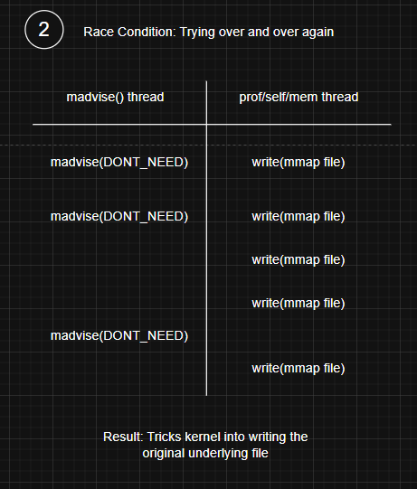

# CVE Reproduce: Dirty Cow (CVE-2016-5195)

### Details

CVE ID:  
**CVE-2016-5195**

Vulnerability Name:  
**Dirty Cow**

Vulnerable Software:  
**Linux Kernel (versions < 4.8.3)**

Vulnerability Type:  
**Local Privilege Escalation (Race Condition in copy-on-write)**

Severity:  
**7.0 CVSS v3 (High), 7.2 CVSS v2 (High)**

---

### Summary

Dirty COW is a race condition vulnerability in the Linux kernel's memory management subsystem, specifically in the copy-on-write mechanism. An unprivileged local user can exploit this flaw to gain write access to read-only memory mappings, which can be abused to modify files that should be immutable (e.g., `/etc/passwd`).

The vulnerability was present in the Linux kernel for over nine years before being publicly disclosed in October 2016. It is called "Dirty COW" because it abuses the Copy-On-Write (COW) optimization and allows "dirty" (unauthorized) modifications.

When successfully exploited, attackers can escalate privileges from a normal user to root without requiring a reboot or kernel module loading.

---

### Example of the Vulnerability

1. The attacker already have access to a low-privileged shell (regular user) on the target machine running a vulnerable kernel (versions < 4.8.3).
2. Attacker use the exploit (e.g, dirty.c from public proof of concept) onto the victim machine.
3. The compiled exploit targets the Linux kernel’s copy-on-write (COW) mechanism to perform a race condition attack. By rapidly writing to a read-only memory mapping of `/etc/passwd`, the exploit tricks the kernel into overwriting the actual file content.
4. Attacker runs the exploit, replacing the root user’s password hash in /etc/passwd with the one he controls.
5. With `/etc/passwd` modified, the attacker switches to the root account using the password he just set.
6. Attacker now have full root privileges on the victim machine by using `sudo su` command, effectively taking complete control.

---

### How it works

Understanding how Dirty COW works can be a bit tricky, I'll explain step by step here.

First, imagine we have a root-owned, read-only file, meaning a normal user process should never be able to modify it. Now, instead of reading or writing to this file in the usual way, the process uses `mmap()` with the `MAP_PRIVATE` flag to map the file into its memory space. This is where Copy-on-Write (COW) comes into play, the kernel lets the process read from the same physical page that the file is stored in, but if the process ever tries to write to it, the kernel quietly makes a private copy of that page just for that process, leaving the original file unchanged.

COW is a memory optimization, multiple processes can share the same physical page until one needs to modify it. At that moment, the kernel duplicates the page and lets the writing process modify its own copy. The original file-backed page in the page cache remains unchanged.

Next, the exploit launches two threads working in parallel. One repeatedly calls `madvise(MADV_DONTNEED)` on the mapped memory. This tells the kernel, “I don’t need these pages right now,” which makes the kernel discard the private copies and mark them for reload from the original file the next time they’re accessed. Meanwhile, the second thread writes to that same mapped memory space through `/proc/self/mem`, which allows writing directly to the memory of the current process.

Here’s where the bug appears, if the timing is just right, the write operation happens during the brief window after `madvise()` discards the page but before the kernel has created a new private copy. Dirty COW is a race condition vulnerability, which means it occurs when the outcome of a program depends on the unpredictable order in which multiple threads or processes access and modify shared resources. In this race condition, the kernel accidentally lets the write go straight into the shared file-backed page cache, modifying the file’s data in memory. Since the page cache is shared by all processes and eventually flushed to disk, the change becomes permanent, even though the process technically never had write permission to the file.

The copy-on-write mechanism is supposed to keep the original (read-only) data clean. The race makes that original page cache dirty, in this case, being modified without proper permissions. Hence the name: Dirty Copy-On-Write (Dirty COW). A normally read-only file ends up with unauthorized modifications because of a flaw in the Copy-on-Write mechanism and become "dirtied".

  

  

Demo: https://www.cs.toronto.edu/~arnold/427/18s/427_18S/indepth/dirty-cow/demo.html

---

### CVE Reproduce
