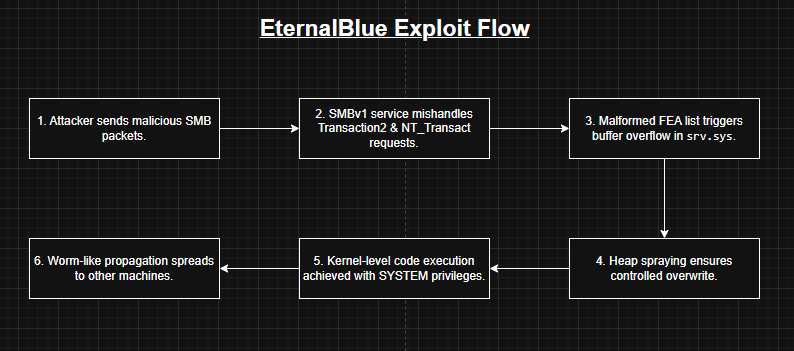
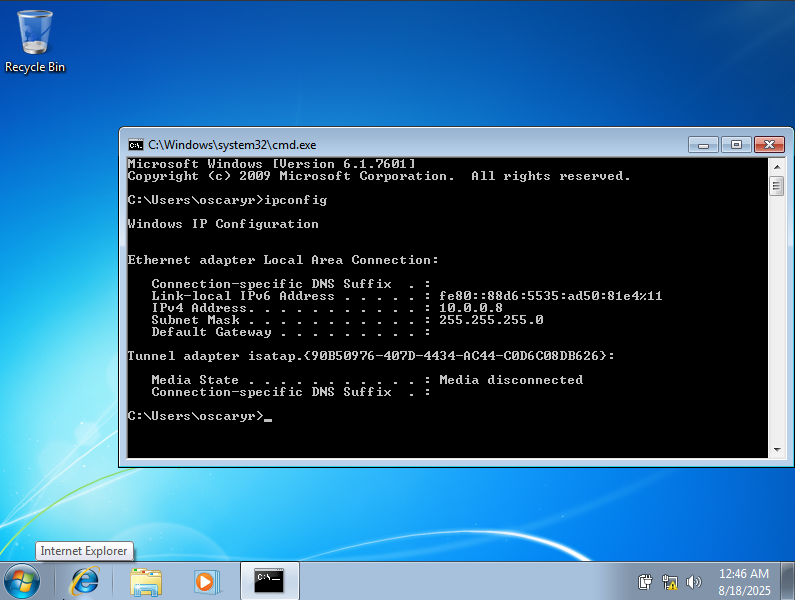
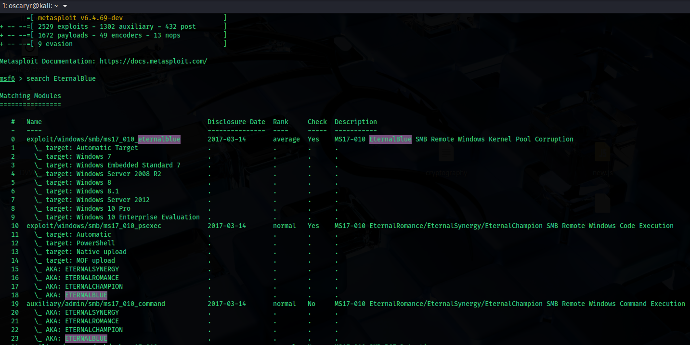
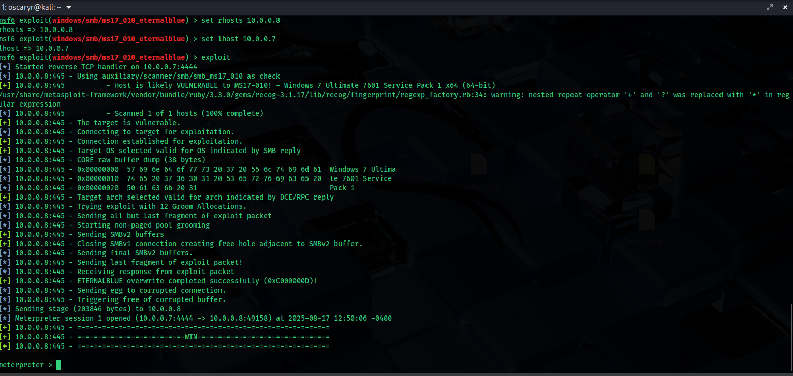
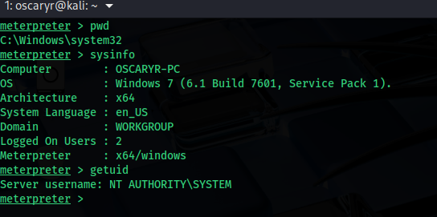

# CVE Reproduce: EternalBlue (CVE-2017-0144)

### Details

CVE ID:  
**CVE-2017-0144**

Vulnerability Name:  
**EternalBlue**

Vulnerable Software:  
**Microsoft Windows (XP, Vista, 7, 8, 8.1, 10 prior to MS17-010 patch; Windows Server 2003, 2008, 2012, 2016)**

Vulnerability Type:  
**Remote Code Execution (via SMBv1 protocol)**

Severity:  
**8.8 CVSS v3 (High), 9.3 CVSS v2 (High)**

---

**MS17-010** is a critical security update released by Microsoft in March 2017 to patch multiple vulnerabilities in the SMBv1 protocol used by Windows systems. These vulnerabilities were later revealed to be part of a **powerful exploit toolkit** allegedly developed by the **NSA (National Security Agency)** and leaked by a group known as the **Shadow Brokers** in April 2017. 

Among the leaked exploits were **EternalBlue (CVE-2017-0144)**, as well as its lesser-known but technically related siblings: **EternalRomance**, **EternalSynergy**, and **EternalChampion** — each targeting different logic flaws within SMB to achieve remote code execution or privilege escalation. 

The exploit names were derived from code strings or internal codenames found in the leaked tools. While all are dangerous, EternalBlue became the most infamous due to its role in real-world attacks, as it being deployed in large global malware attack like **WannaCry** and **NotPetya**.

---

### Summary

EternalBlue is the codename given to a Windows SMBv1 vulnerability disclosed in 2017 as part of the Shadow Brokers leak of NSA tools. The flaw lies in how Microsoft’s SMBv1 protocol improperly handles specially crafted packets, allowing attackers to remotely execute arbitrary code with system-level privileges, also known as **"Windows SMB Remote Code Execution Vulnerability"**.

This exploit was later weaponized by the WannaCry and NotPetya ransomware outbreaks, making it one of the most impactful vulnerabilities of all time.

---

### Example of the Vulnerability

1. The attacker scans a network to find a host with SMBv1 enabled and unpatched.

2. They craft a malicious SMB packet that takes advantage of a buffer overflow in the SMBv1 message handling code.

3. When the vulnerable host processes the packet, it overwrites memory structures, allowing the attacker to inject and execute arbitrary code in kernel context.

4. The attacker gains remote system-level access without authentication.

---

### How it works

#### What is SMB?

SMB stands for **Server Message Block**, which is a network protocol used by Windows for file sharing, printer sharing, and inter-process communication. It allows a client to send requests like "open file" or "write file", and the server to respond. EternalBlue specifically targets **SMBv1**, the legacy version that shipped with Windows XP up to Windows 7 and Windows Server 2008.

The whole vulnerability happened was due to a function inside `srv.sys` driver for parsing SMB requests, it was the `srv!SrvOs2FeaListSizeToNt` function. `srv!SrvOs2FeaListSizeToNt` is responsible for converting SMB’s “File Extended Attributes” (FEA) structures from OS/2 format into Windows NT format.

#### First bug - `srv!SrvOs2FeaListSizeToNt`

EternalBlue wasn’t just one bug, it chained three separate logic errors in SMB to get reliable RCE. The first bug was the aforementioned `srv!SrvOs2FeaListSizeToNt` function. Extended Attributes (EA) are metadata fields attached to files and these are sent as a list of FEA structures in SMB. Normally, FEA lists are converted from OS/2 format to NT format by the function, but due to an error in size calculation, a specially crafted FEA list can cause a buffer overflow in kernel memory.

#### Second bug - `SMB_COM_TRANSACTION2` and `SMB_COM_NT_TRANSACT`

To deliver this oversized payload, the exploit abuses the SMB commands `SMB_COM_TRANSACTION2` and `SMB_COM_NT_TRANSACT`. Normally, SMB limits the size of each request, but these two commands allowed attackers to send chunks of data split across multiple packets. EternalBlue used this to bypass size checks and deliver a gigantic malicious FEA list to trigger the overflow. Once the crafted packets are received, the vulnerable function processes them incorrectly and overflows memory.

#### Third bug - Heap Spraying

To ensure reliable exploitation, EternalBlue also uses the third bug in SMBv1 that allows **heap spraying**, where it floods the system with SMB allocations so that the overflow overwrites controlled memory rather than random data. With this setup, the attacker gains code execution in kernel space with SYSTEM privileges, allowing full compromise of the target. The exploit then goes a step further by embedding worm-like functionality, scanning and infecting other vulnerable machines automatically, which is why the WannaCry and NotPetya outbreaks spread so rapidly across the globe.

  

---

### CVE Reproduce

#### Setup

- Windows 7 (SMBv1 enabled, pre MS17-010 patch)
- Metasploit in Kali Linux

#### Exploitation Step

1. Setup Windows 7 vulnerable machine:

     

2. Launch Metasploit in Kali Linux and search for EternalBlue module:

     

3. Set rhosts (Windows 7 IP) and lhost (Kali Linux IP), then start the exploit:

     

#### Result

A shell session with system privilege has been created:

  

---

### Patch & Mitigation

1. Patches:
   - Microsoft released security updates in MS17-010 (March 2017) that fixed the vulnerability by properly validating SMB packets and preventing buffer overflow in `srv.sys`.
   - Even unsupported systems like Windows XP and Server 2003 received emergency patches due to the critical nature of the flaw.

2. Mitigation:
   - Disable SMBv1 protocol entirely as it is insecure and unnecessary for most modern environments.
   - Restrict SMB traffic to trusted internal networks only, block port 445/TCP from being exposed to the internet.

---

### Reflection

EternalBlue is one of the most devastating vulnerabilities in history, not only because of its severity but also due to its real-world consequences. The exploit was leaked from the NSA’s toolkit and quickly weaponized by cybercriminals, fueling WannaCry ransomware and NotPetya outbreaks that crippled hospitals, shipping companies, and governments worldwide.

From a technical perspective, EternalBlue demonstrated how dangerous kernel-level buffer overflows can be, especially when tied to a protocol as widely deployed as SMB. From a defensive perspective, it highlighted the importance of timely patching, protocol deprecation, and segmentation of critical infrastructure.

Today, EternalBlue remains a cautionary tale. Even years after patches were released, there are still unpatched systems continue to be exploited in the wild, proving that attackers don’t need to invent new exploits if old ones still work.
