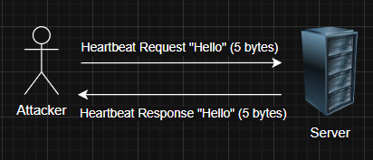
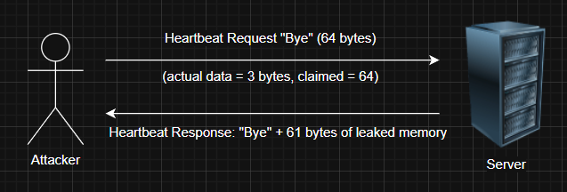

# CVE Reproduce: Heartbleed (CVE-2014-0160)

### Details

CVE ID: <br>
**CVE-2014-0160**

Vulnerability Name: <br>
**Heartbleed**

Vulnerable Software: <br>
**OpenSSL versions 1.0.1 through 1.0.1f (inclusive), and 1.0.2-beta, when using the TLS heartbeat extension (removed in TLS 1.3)**

Vulnerability Type: <br>
**Information Disclosure (Buffer Over-read in TLS/DTLS heartbeat extension)**

Severity: <br>
**7.5 CVSS v3 (High), 5.0 CVSS v2 (Medium)**

---

### Summary

Heartbleed is a critical vulnerability in the OpenSSL cryptographic library, specifically in the implementation of the TLS heartbeat extension due to incorrect memory handling. 
The flaw in its implementation of the TLS/DTLS heartbeat functionality allows an attacker to read arbitrary chunks of memory from a vulnerable server’s RAM up to 64KB at a time without authentication. 
This can expose sensitive data such as private encryption keys, usernames, passwords, and session cookies, potentially compromising the entire security of affected systems.

---

### Example of the Vulnerability

1. A web server runs an application that uses a vulnerable version of OpenSSL (1.0.1 to 1.0.1f) with the TLS heartbeat extension enabled.

2. An attacker sends a malformed heartbeat request to the server. This message contains:
   - A small payload (e.g., 1 byte)
     
   - But claims the payload is much larger (e.g., 64 KB)

3. Due to lack of bounds checking in the OpenSSL implementation, the server:
   - Reads the claimed size (64 KB) from memory
     
   - Returns the full 64 KB chunk of memory back to the attacker, even though only 1 byte was actually sent

4. The returned memory may contain sensitive data, such as:
   - Private TLS keys
     
   - Usernames and passwords

   - Session cookies

   - Email contents or other decrypted data

5. The attacker can repeat this process multiple times to leak more memory, increasing the chances of retrieving useful secrets.
   - Normal Heartbeat Exchange (as intended):
     <br><br>

   - Malicious Heartbeat Exploit (Heartbleed):
     <br><br>

---

### How it works

#### What is a Heartbeat in TLS

A heartbeat is a feature in the TLS protocol used to check if the other end of a connection is still alive without renegotiating the entire session.
- It works by sending a small message (called a heartbeat request) to the peer.
  
- The peer is supposed to respond with the exact same message (a heartbeat response).
  
This keeps the connection active and avoids timeouts during idle periods.

Think of it like saying:

```
Client: “Hey, are you still there?”
Server: “Yep, here’s your message back.”
```

This feature was introduced in the TLS/DTLS heartbeat extension (RFC 6520) and is mostly used in long-lived TLS connections.

#### Vulnerability Flow

1. Heartbeat Mechanism:
   - The TLS heartbeat extension allows one peer to send a small piece of data (e.g., "abc") and specify its length (e.g., 3 bytes).

   - The other peer must respond by echoing back the exact data and length.

2. The Bug:
   - In vulnerable versions of OpenSSL (1.0.1–1.0.1f), there is no validation to ensure the actual size of the received heartbeat payload matches the claimed length.

   - An attacker can send a malformed heartbeat request like this:

     - Actual data: 1 byte (e.g., "A")

     - Claimed length: 64 KB

3. Memory Leak:
   - The server blindly reads and returns 64 KB of memory from its own RAM, starting from the location of the 1-byte payload.

   - This leaked memory may contain:

     - TLS private keys

     - Passwords

     - Session cookies

     - Decrypted data

     - Other sensitive application information

4. Exploitation:
   - The attacker can send this fake heartbeat repeatedly, each time extracting different parts of the server’s memory.
  
   - Since this doesn't require authentication or special privileges, it can be done anonymously and remotely.
  
---

### CVE Reproduce

#### Setup
- Vulnerable version of OpenSSL (1.0.1f) and Nginx server (TLS v1.2)
- Docker image created by [gescobero](https://hub.docker.com/r/gescobero/heartbleed)
- Download and execute the Docker container (Vulnerable Nginx server)
  ```bash
  docker run -p 4443:443 -it --rm --name hb gescobero/heartbleed:1.0
  ```

#### Result
